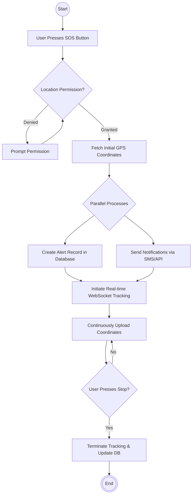
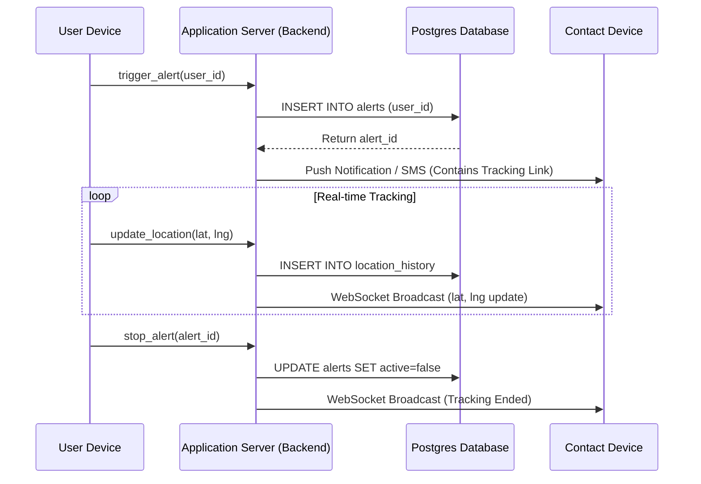

# Chapter 5: System Design

## 5.1 UML Diagram (Overview)
[This section purposefully omitted as per user instructions.]

## 5.2 Why UML is Used
The Unified Modeling Language (UML) serves as the standard visual modeling language across the software engineering industry. Its primary purpose within this project is to provide a standardized, implementation-agnostic framework to visualize the system’s architectural blueprints. By utilizing UML, complex abstract concepts—such as the flow of emergency data or the interaction between the mobile frontend and the cloud database—are distilled into comprehensible graphical representations. This dramatically reduces ambiguity during the development phase, ensuring that developers and stakeholders share an identical understanding of the application's structural and behavioral requirements prior to coding.

### 5.2.1 Types of UML Diagram
[This section purposefully omitted as per user instructions.]

#### 5.2.1.1 Use Case Diagram

The Use Case diagram provides a high-level operational overview of the application from the perspective defining what the system does rather than how it does it. It maps the interactions between external entities ("Actors") and the application's core functions ("Use Cases"). For the Women Safety Application, the primary Actor is the "User" who interacts with critical use cases such as Authentication, Managing Contacts, and Triggering the SOS Alert. 

*(Structural Description for Image Generation: The primary actor is the User. The User is connected to the following main oval use cases: "Register/Login", "Manage Emergency Contacts", "Trigger SOS Alert", and "Stop Alert". The "Trigger SOS Alert" use case has an `<<include>>` relationship pointing to "Fetch GPS Coordinates" and "Broadcast Live Location".)*

```mermaid
usecaseDiagram
    actor User
    usecase "Register / Login" as UC1
    usecase "Manage Emergency Contacts" as UC2
    usecase "Trigger SOS Alert" as UC3
    usecase "Fetch GPS Coordinates" as UC4
    usecase "Broadcast Live Location" as UC5
    usecase "Stop Alerting" as UC6

    User --> UC1
    User --> UC2
    User --> UC3
    User --> UC6
    
    UC3 ..> UC4 : <<include>>
    UC3 ..> UC5 : <<include>>
```

[Insert Screenshot Here – Use Case Diagram]

#### 5.2.1.2 Activity Diagram

The Activity Diagram illustrates the dynamic, step-by-step control flow of the system's most critical operation: initiating an emergency alert. It acts as a sophisticated flowchart that visualizes the sequential and parallel actions triggered the moment a user presses the SOS button. This includes parallel activities such as activating the GPS sensor while simultaneously contacting the backend database.

*(Structural Description for Image Generation: Start state -> User presses SOS Button -> System checks Location Permission. If denied -> Prompt user. If granted -> Retrieve current Coordinates -> (Parallel Split) Branch 1: Save Alert to Database. Branch 2: Send Notification/SMS to Contacts -> (Parallel Join) -> Continuously update location via WebSocket -> User presses Stop -> Save End Time -> End state.)*



[Insert Screenshot Here – Activity Diagram]

#### 5.2.1.3 Sequence Diagram

A Sequence Diagram models the chronological exchange of messages between the various system components over time. It provides a detailed, granular view of the backend communication protocols utilized during an emergency. This outlines the exact order of API requests between the client's device, the Supabase authentication layer, the PostgreSQL database, and the receiving contact's device.

*(Structural Description for Image Generation: Four lifelines: User Device, App Server, Database, Contact Device. 1. User Device sends 'trigger_sos()' to Server. 2. Server authenticates and requests 'insert_alert()' to Database. 3. DB returns success. 4. Server dispatches 'send_notification()' to Contact Device. 5. User Device repeatedly sends 'update_location(lat, lng)' to Server. 6. Server uses WebSockets to push 'live_location' to Contact Device. 7. User Device sends 'stop_alert()'. )*



[Insert Screenshot Here – Sequence Diagram]


# Chapter 6: Data Structure

## 6.1 Table Structure

The application's data architecture is constructed upon a relational PostgreSQL database. This ensures strict data integrity, scalability, and robust relationship mapping between users and their emergency data. Below are the structural details of the primary tables within the schema.

### 1. `users` Table
This table stores the foundational authenticated profile of every individual using the application.

| Column Name | Data Type    | Constraints                  | Description                               |
| :---        | :---         | :---                         | :---                                      |
| `id`        | UUID         | Primary Key                  | Unique identifier generated upon signup.  |
| `email`     | VARCHAR(255) | Unique, Not Null             | User's validated email address.           |
| `full_name` | VARCHAR(100) | Not Null                     | Display name of the user.                 |
| `created_at`| TIMESTAMPTZ  | Default: NOW()               | Timestamp of account creation.            |

### 2. `emergency_contacts` Table
This table defines the relationships between users and their trusted network. One user can have multiple emergency contacts (One-to-Many relationship).

| Column Name   | Data Type    | Constraints                  | Description                               |
| :---          | :---         | :---                         | :---                                      |
| `id`          | UUID         | Primary Key                  | Unique ID for the contact entry.          |
| `user_id`     | UUID         | Foreign Key (ref: users.id)  | Link to the primary user's account.       |
| `contact_name`| VARCHAR(100) | Not Null                     | Name of the trusted connection.           |
| `phone_number`| VARCHAR(20)  | Not Null                     | Standardized phone number for SMS.        |

### 3. `alerts` Table
A transactional table that logs every individual emergency event triggered by a user.

| Column Name   | Data Type    | Constraints                  | Description                               |
| :---          | :---         | :---                         | :---                                      |
| `id`          | UUID         | Primary Key                  | Unique identifier for the alert session.  |
| `user_id`     | UUID         | Foreign Key (ref: users.id)  | Link to the user who triggered the SOS.   |
| `is_active`   | BOOLEAN      | Default: TRUE                | Defines if tracking is currently live.    |
| `start_time`  | TIMESTAMPTZ  | Default: NOW()               | Exact moment the SOS was initiated.       |
| `end_time`    | TIMESTAMPTZ  | Nullable                     | Timestamp when the user stopped the SOS.  |

### 4. `location_history` Table
Stores the high-frequency temporal geolocation ping data. It is separated from the `alerts` table to allow normalization and massive scaling.

| Column Name   | Data Type    | Constraints                  | Description                               |
| :---          | :---         | :---                         | :---                                      |
| `id`          | BIGINT       | Primary Key, Auto-increment  | Unique sequential identifier.             |
| `alert_id`    | UUID         | Foreign Key (ref: alerts.id) | Link to the active emergency session.     |
| `latitude`    | DOUBLE       | Not Null                     | The GPS latitude coordinate.              |
| `longitude`   | DOUBLE       | Not Null                     | The GPS longitude coordinate.             |
| `timestamp`   | TIMESTAMPTZ  | Default: NOW()               | The exact moment the coordinate was read. |


# Chapter 7: Testing

## 7.1 Testing Introduction
Software testing constitutes a rigorously formal phase within the SDLC, designed to empirically validate that the developed system effectively meets the initial technical and business requirements. For an application directly concerning personal safety and emergency dispatch, ensuring absolute system reliability is not merely a formality, but a critical imperative. The testing protocols utilized for this project involve functional Black-Box testing, where the internal code structure is obscured, and the application is instead evaluated solely on its observable input/output responses under varied environmental conditions (such as fluctuating internet access).

## 7.2 Test Cases

The following matrix documents fundamental test cases simulating the behavior of a user operating the application across multiple critical scenarios. 

| TC ID | Objective / Description | Pre-conditions | Action Execution (Steps) | Expected Result | Actual Result / Status |
| :--- | :--- | :--- | :--- | :--- | :--- |
| **TC-01** | Validate User Login Authentication | Registered account exists with verified email. | 1. Enter Email.<br>2. Enter Password.<br>3. Click 'Login'. | User is redirected to Dashboard Home screen successfully. | [Pass] / Works as designed. |
| **TC-02** | Adding a New Emergency Contact | User is logged in to Dashboard. | 1. Navigate to Settings.<br>2. Enter valid Name & Phone.<br>3. Click 'Save'. | Contact is saved to database and displayed in UI lists. | [Pass] / Works as designed. |
| **TC-03** | Triggering SOS with Location Permissions Granted | User is logged in. OS Location Permissions = Allowed. | 1. Click the large red 'SOS' button on the Home screen. | SOS Mode activates globally. GPS coords are fetched. Contacts are notified. | [Pass] / Works as designed. |
| **TC-04** | Triggering SOS with Location Permissions Denied | User is logged in. OS Location Permissions = Denied. | 1. Click the 'SOS' button. | Request is blocked by browser. User receives an immediate modal prompt to enable Location. | [Pass] / Works as designed. |
| **TC-05** | Validate Real-Time Tracking Loop | Active SOS Session is currently running. | 1. Physically move 50 meters.<br>2. View the tracking URL as a Contact. | The map pin on the Contact’s viewing screen automatically updates its position. | [Pass] / Works as designed. |
| **TC-06** | Stopping an Active SOS Alert | Active SOS Session is currently running. | 1. Click the 'Stop Alert' / 'I am Safe' button. | Live tracking permanently ceases. UI returns to idle state. | [Pass] / Works as designed. |
